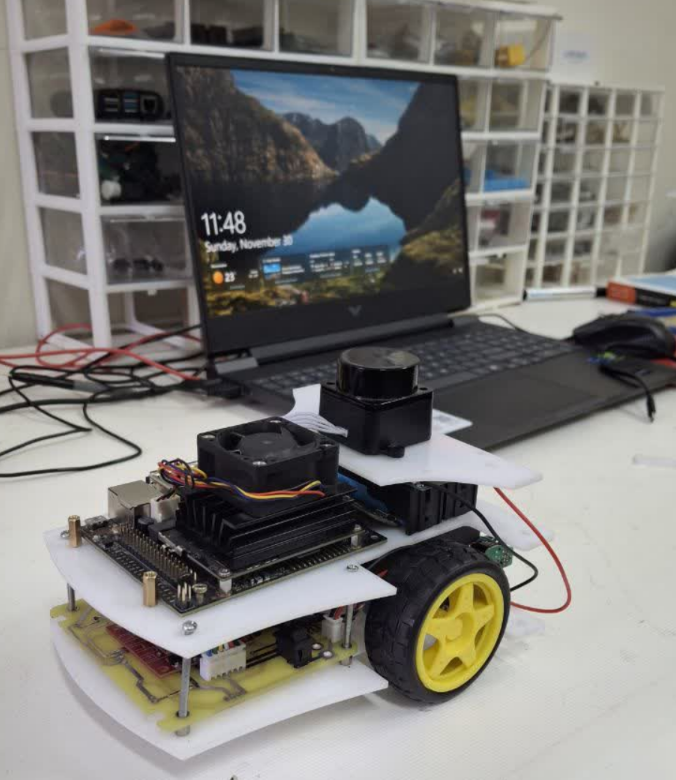

# DRL-for-RABO-Navigation-Using-ROS2

<div align="center">
  
</div>

## 📌 Introduction

This repository provides a **ROS 2 and PyTorch-based framework** for developing and evaluating deep reinforcement learning (DRL) algorithms for autonomous navigation in mobile robots.

The framework supports training in simulation and deployment in both simulated and real-world environments. It is initially designed based on the TurtleBot3 platform, but can be extended to any robot capable of providing LiDAR and odometry data, and accepting velocity control commands.

---

## 🚀 Features

- Train, store, load, and evaluate DRL-based navigation agents in simulation
- Deploy trained models on real robots for autonomous navigation and obstacle avoidance
- Analyze the impact of hyperparameters on training performance and convergence
- Extend capabilities such as backward motion and frame stacking
- Implement and test custom DRL algorithms  
  *(Currently supported: DQN, DDPG, TD3)*

---

## ⚙️ Installation

### 1. System Requirements
- Ubuntu 22.04
- ROS 2 Humble
- Python 3.10
- PyTorch

---

### 2. Clone the Repository

```bash
git clone https://github.com/kaveh-hooshmandi/RABO-drl-robot-navigation.git
cd RABO-drl-robot-navigation
```

## Table of Contents
- [DRL-for-Mobile-Robot-Navigation-Using-ROS2](#drl-for-mobile-robot-navigation-using-ros2)
  - [Table of Contents](#table-of-contents)
  - [Project Structure](#project-structure)
  - [Requirements](#requirements)
    - [Other requirements](#other-requirements)
  - [Build](#build)
  - [Training](#training)
  - [Testing](#testing)
  - [Additional Demos](#additional-demos)
  - 
## 💡 Research Contributions

- Migrated the framework from **ROS 2 Foxy to ROS 2 Humble**, improving compatibility with newer ROS2 ecosystems. *(In progress)*  
- Designing a **multi-sensor fusion pipeline** integrating LiDAR and vision for enhanced SLAM and navigation performance. *(In progress)*  
- Extending the DRL framework with **robust control and reinforcement learning** for uncertainty-aware autonomous navigation. *(Planned)*  

---

## 🚀 Project Overview

A ROS 2-based deep reinforcement learning framework for autonomous navigation of mobile robots.

This work focuses on bridging:
- Reinforcement Learning  
- Robust Control  
- Sensor Fusion (LiDAR + Vision)  


## 🖼️ System Overview



## Project Structure
```txt
.
├── 📂 docs/: contains demo videos
│   ├── 📄 dynamic_environment.mp4
│   ├── 📄 slam.mp4
│   └── 📄 simulation.mp4
├── 📂 drl_agent/: main deep reinforcement learning agent directory
│   ├── 📂 config/: contains configuration files
│   ├── 📂 launch/: contains launch files
│   ├── 📂 scripts/: contains code for environment, policies, and utilities
│   └── 📂 temp/: stores models, logs, and results
├── 📂 drl_agent_description/: contains robot description files, models, and URDFs
│   ├── 📂 launch/: launch files for agent description
│   ├── 📂 meshes/: 3D models of the robot
│   ├── 📂 models/: contains specific model files for kinect sensors
│   └── 📂 urdf/: URDF files for camera, laser, and robot description
├── 📂 drl_agent_gazebo/: contains Gazebo simulation configuration and world files
│   ├── 📂 config/: simulation and SLAM configuration files
│   ├── 📂 launch/: Gazebo launch files for various setups
│   ├── 📂 models/: Gazebo models used in the simulation
│   └── 📂 worlds/: simulation worlds for training and testing environments
├── 📂 drl_agent_interfaces/: custom action, message, and service definitions
│   ├── 📂 action/: defines DRL session actions
│   ├── 📂 msg/: empty for now
│   └── 📂 srv/: service definitions for environment and robot interactions
├── 📂 velodyne_simulator/: Velodyne LiDAR simulation setup

```

## Requirements
- Install [Ubuntu 22.04](https://www.releases.ubuntu.com/jammy/)
- Install [ROS2 Humble](https://docs.ros.org/en/humble/Installation/Ubuntu-Install-Debians.html)
- Install [Gazebo](https://classic.gazebosim.org/tutorials?tut=install_ubuntu&cat=install)
- Install `gazebo_ros_pkgs` by running:
    ```bash
    sudo apt install ros-humble-gazebo-*
    ```
- Install [PyTorch 2.3.1](https://pytorch.org/get-started/locally/)

### Other requirements
```bash
pip install -r requirements.txt
```

## Build
- Clone this repository:
    ```bash
    mkdir -p ~/drl_agent_ws/src
    cd ~/drl_agent_ws/src
    git clone --recurse-submodules git@github.com:anurye/DRL-for-Mobile-Robot-Navigation-Using-ROS2.git .
    ```
- Install dependencies:
    ```bash
    cd ~/drl_agent_ws
    rosdep install --from-path src -yi --rosdistro humble
    ```
- Build the workspace:
    ```bash
    cd ~/drl_agent_ws
    colcon build
    ```

## Training
- Export the environment variable `DRL_AGENT_SRC_PATH`:
    ```bash
    echo 'export DRL_AGENT_SRC_PATH=~/drl_agent_ws/src/' >> ~/.bashrc
    source ~/.bashrc
    ```
- Launch the simulation:

    Terminal 1:
    ```bash
    cd ~/drl_agent_ws
    source install/setup.bash
    ros2 launch drl_agent_gazebo simulation.launch.py
    ```

  > [!NOTE]
  > If gazebo is not starting, you may want to source it.

    ```bash
    source /usr/share/gazebo/setup.bash 
    ```
    Terminal 2:
    ```bash
    cd ~/drl_agent_ws
    source install/setup.bash
    ros2 run drl_agent environment.py 
    ```

    Terminal 3:
    ```bash
    cd ~/drl_agent_ws
    source install/setup.bash
    ros2 run drl_agent train_td7_agent.py
    ```

## Testing
If you have closed the terminals, restart the simulation in Terminal 1 and Terminal 2 as described above.

Terminal 3:
```bash
cd ~/drl_agent_ws
source install/setup.bash
ros2 run drl_agent test_td7_agent.py
```

## Additional Demos

<table width="100%">
  <tr>
    <td align="center" width="50%">
      
    </td>
    <td align="center" width="50%">
      
    </td>
  </tr>
</table>


<!-- ```txt
@mastersthesis{Nurye-2024,
author = {Ahmed Yesuf Nurye},
title = {Mobile Robot Navigation in Dynamic Environments},
year = {2024},
month = {October},
school = {Warsaw University of Technology},
address = {Warsaw, Poland},
number = {WUT4f18e5c2cd214a9cb555f730fa440901},
keywords = {Mobile Robot Navigation, Deep Reinforcement Learning, ROS2, Gazebo},
}
``` -->
=======
# RABO-drl-robot-navigation
Robust-DRL-Navigation-ROS2

